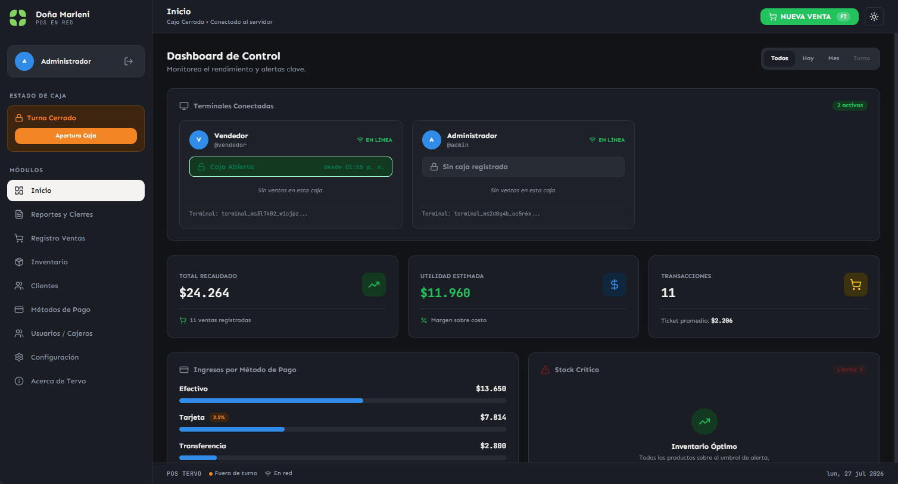
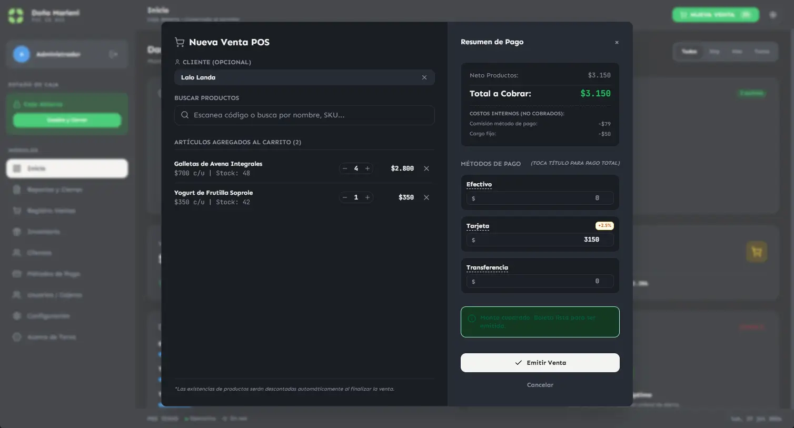
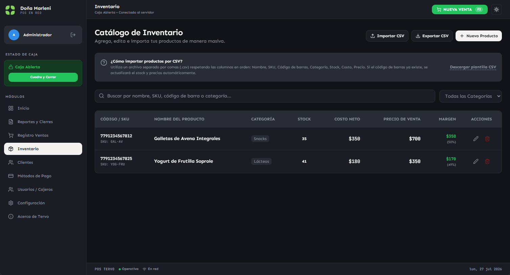

> ⚠️ **IMPORTANTE: PROYECTO EN ETAPA MUY TEMPRANA DE DESARROLLO** ⚠️
>
> Este proyecto está en una fase inicial y muchas funcionalidades aún no están implementadas o no funcionan correctamente. Si decides probarlo, ten en cuenta que el proyecto sigue evolucionando.

Tervo es un sistema punto de venta diseñado para funcionar en red local.

Un computador actúa como servidor central con todos los datos de la tienda almacenados en SQLite. Los vendedores acceden desde otras máquinas de la red para registrar ventas, gestionar inventario y operar sus cajas de forma independiente.

No requiere internet, no depende de servicios en la nube y no tiene suscripciones. Los datos son tuyos y permanecen en tu red.

## Capturas de pantalla





## Características principales

- **Servidor centralizado** — Un solo computador almacena toda la base de datos SQLite.
- **Terminales de venta en red** — Los vendedores acceden desde cualquier PC de la red local.
- **Sesiones exclusivas** — Un usuario no puede estar logueado en dos terminales a la vez.
- **Caja independiente por terminal** — Cada vendedor abre y cierra su propia caja.
- **Dashboard admin** — El administrador ve en tiempo real las terminales conectadas y sus estadísticas.
- **Inventario con importación CSV** — Gestión de productos con código de barras.
- **Registro de ventas con método de pago** — Soporte para pagos divididos entre múltiples métodos.
- **Distribuible sin código fuente** — Script de release que empaqueta todo para distribución.

## Comienza a usar Tervo

### Requisitos previos
- Node.js (v18 o superior)

### Instalación para desarrollo
```bash
git clone https://github.com/lorspi/Tervo.git
cd Tervo
npm install
```

### Ejecutar en desarrollo
```bash
# Servidor backend + frontend en paralelo
npm run dev:full

# O por separado:
npm run dev:server   # Backend en puerto 3001
npm run dev          # Frontend en puerto 8080
```

### Construir para producción
```bash
npm run build        # Compila frontend + backend
npm run start        # Arranca el servidor de producción
```

### Generar paquete distribuible
```bash
npm run release
```

Esto genera una carpeta `release/` lista para copiar a cualquier máquina con Node.js instalado. Incluye:
- Frontend compilado
- Servidor compilado en un solo archivo
- `iniciar.bat` para arrancar con doble clic en Windows
- Instrucciones para el usuario final

### Acceso
- Desde el servidor: `http://localhost:3001`
- Desde la red local: `http://<IP-DEL-SERVIDOR>:3001`

### Credenciales por defecto
| Usuario | Contraseña | Rol |
|---------|-----------|-----|
| admin | 123 | Administrador |
| vendedor | 123 | Vendedor |

## Stack Tecnológico
- React 19
- TypeScript
- Vite
- Tailwind CSS
- Zustand
- Express
- SQLite (sql.js)
- Lucide React

## Licencia
Tervo está licenciado bajo la Licencia Apache 2.0. Ver el archivo [LICENSE](./LICENSE) para más detalles.

## Implementación y personalización

¿Te interesa implementar Tervo en tu negocio o necesitas adaptarlo a requerimientos específicos? Ofrezco servicios de implementación, configuración y desarrollo a medida.

📩 [Conversemos sobre tu proyecto → lorspi.com](https://lorspi.com)

## Apoya al creador
¿Te gusta mi proyecto? Invítame a un café

<a href="https://ko-fi.com/lorspi" target="_blank">
  
</a>
